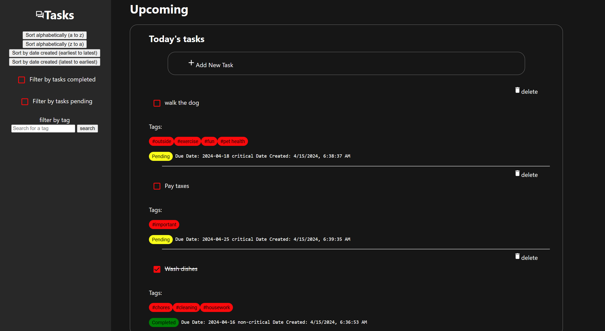

# Todo List Application

## Overview

This Todo List application is a dynamic web application built using React and TypeScript. It allows users to manage their daily tasks efficiently with features for tagging, filtering, and sorting tasks based on various criteria.

## Features

- **Task Status Identification**: Tasks can be marked as completed or pending. Completed tasks are visually distinguished by being struck through and are automatically moved to the bottom of the list.
- **Tags**: Users can assign multiple tags to each todo item, facilitating organized task categorization.
- **Filtering Options**: The application supports filtering todo items by tags, completion status (completed or pending), which helps in quickly finding relevant tasks.
- **Sorting Capabilities**: Todo items can be sorted alphabetically or based on the date and time of creation, allowing users to easily organize their views.
- **Interactive Checklist**: Each completed task is accompanied by a checkbox, providing a clear visual indication of its status.

  

## Technologies

- **React**: A JavaScript library for building user interfaces.
- **TypeScript**: A typed superset of JavaScript that compiles to plain JavaScript.
- **Docker**: Used to containerize the application, ensuring consistency across various development and production environments.

## Prerequisites

Before running the application, ensure you have the following installed:
- Docker

## Getting Started

To run the Todo List application locally using Docker, follow these steps:

### Clone the Repository

```bash
git clone https://github.com/vmannn/React-todo-list.git
cd todo-list-ochia

Build the docker image

docker build -t todoapp:dev .

 Run the application
docker run -it -p 3000:3000 todoapp:dev
The application will now be accessible at http://localhost:3000.


